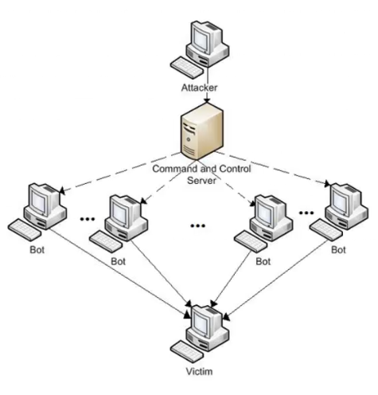

# Botnets
Ehical Hacking - create a zombie computer network

## Tool : `BeEF`
<hr>
The meaning of botnet has extended to networks of zombie machines, used in particular for mining cryptocurrencies but also for malicious uses, such as sending spam and computer viruses, or computer attacks by denial of service (DDoS).
<center>

</center>

Go to 
```bash
sudo nano /usr/share/beef-xss/modules/persistence/confirm_close_tab/config.yaml
```
output
```bash
/usr/share/beef-xss/modules/persistence/confirm_close_tab/config.yaml           
#
# Copyright (c) 2006-2019 Wade Alcorn - wade@bindshell.net
# Browser Exploitation Framework (BeEF) - http://beefproject.com
# See the file 'doc/COPYING' for copying permission
#
beef:
    module:
        confirm_close_tab:
            enable: true
            category: "Persistence"
            name: "Confirm Close Tab"
            description: "Shows a confirm dialog to the user when they try to c>
            authors: ["antisnatchor"]
            target:
                user_notify: ["ALL"]
                not_working: ["O"]

```